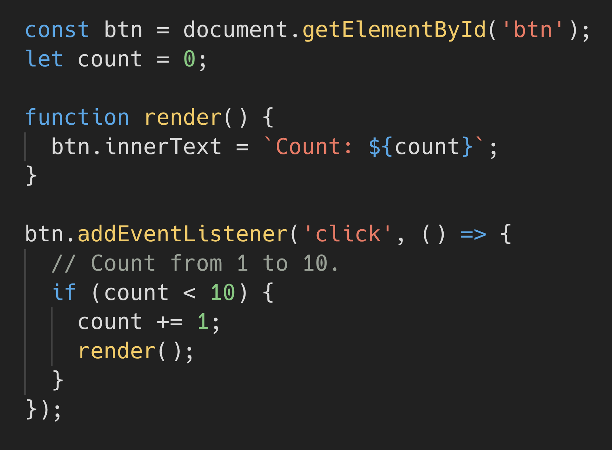
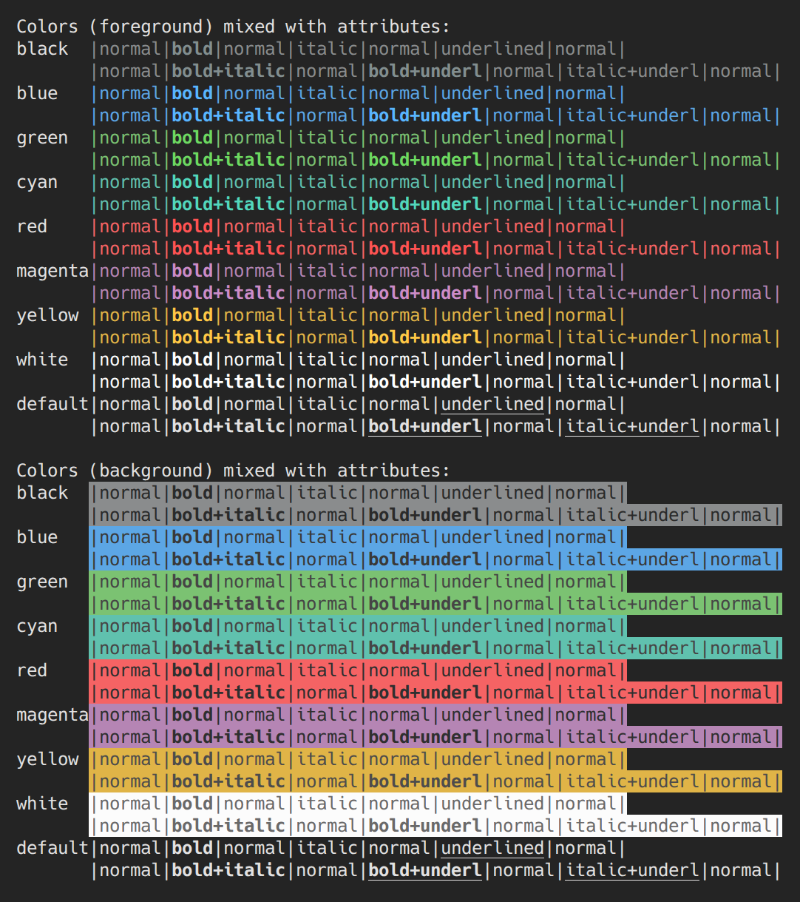

# Midnight Calm


A minimal dark theme focused on Rust and TypeScript.

## Screenshots

Rust:


TypeScript:



Terminal:



## Preview

Open this repository in VS Code and press **F5** (Run → Start Debugging) to open an Extension Development Host and try the theme.
You can also use the included helper:

```bash
just preview
```

## Packaging

Package the extension (produces a `.vsix`) locally:

```bash
just package
```
